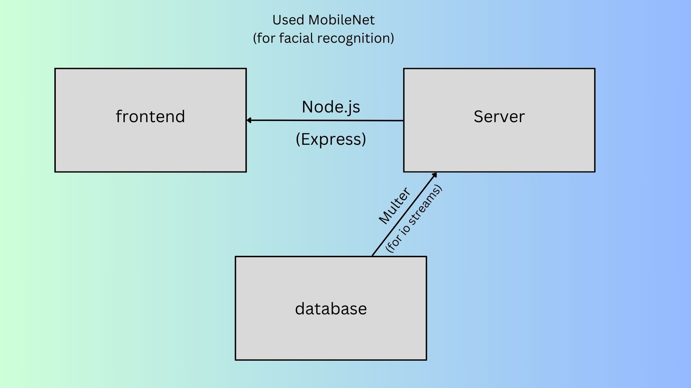
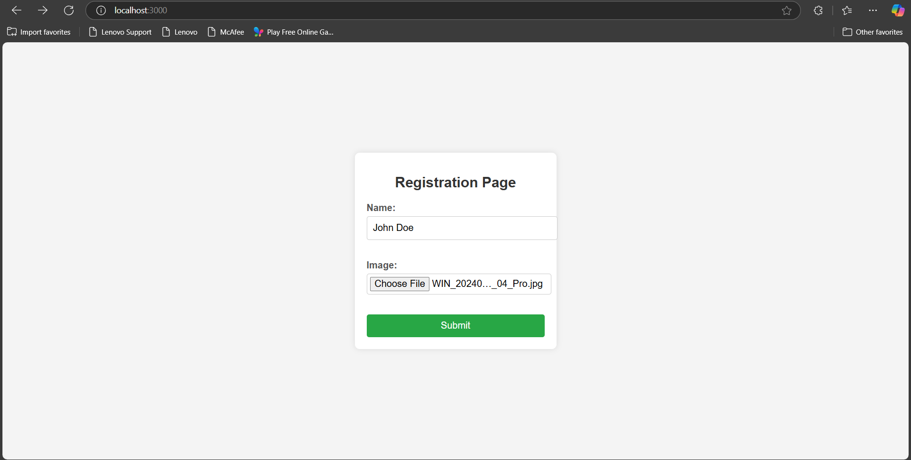
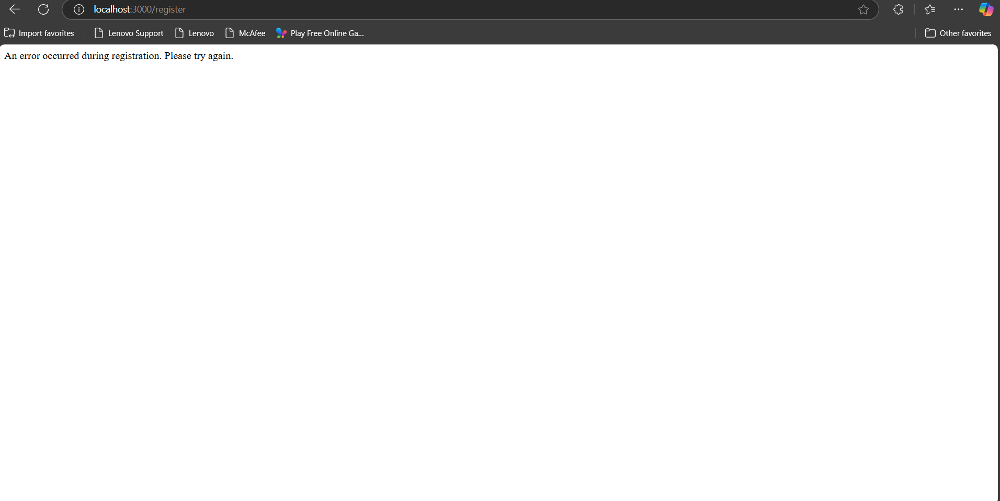

# Registration System with Social Network Features and Facial Recognition
This project is a Node.js-based registration system that allows users to register by providing their name and an image. It also includes social network features such as follow/unfollow functionality. When a user reaches a certain number of followers, they are transformed into a prominent user. If a user tries to register with a name that matches a prominent user, the system performs facial recognition to check if the uploaded image matches the prominent user's image. If a match is found, registration is denied.

## Techstack

## Features
**User Registration**:

Users can register by providing their name and uploading an image.

**Prominent User Check:**

The system checks if the provided name exists in the prominent_users.txt file.

**Facial Recognition:**

If the name matches a prominent user, the system uses face-api.js to compare the uploaded image with the corresponding image in the prominent_images folder.

**Registration Denial:**

If the facial recognition match is above a threshold (0.75), registration is denied.

As shown:

**Social Network Features:**

1. Users can follow and unfollow other users.
2. When a user reaches a certain number of followers (e.g., 100), they are transformed into a prominent user.

**Error Handling:**

Proper error handling for missing inputs, no face detection, and file system errors.
